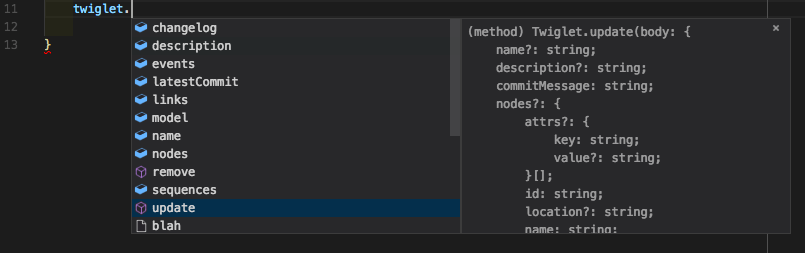

# @buildit/twig-api-wrapper

## PURPOSE

This project is a nodejs helper library for getting data into [Twig](http://github.com/buildit/twig). It is designed to abstract out all of the HTTP calls necessary so you can get right into the data entry. This project is written in typescript and published with definition files allowing you to take advantage of editors with proper code completion such as [vscode](https://code.visualstudio.com/). If your editor supports it, it will also help with paremeters for each method.


## Use

```Shell
npm install -S @buildit/twig-api-wrapper
```

Then in your project

```JavaScript
const { getConfig, login, Twiglet, Model } = require('@buildit/twig-api-wrapper');
const config = getConfig();
config.
```
